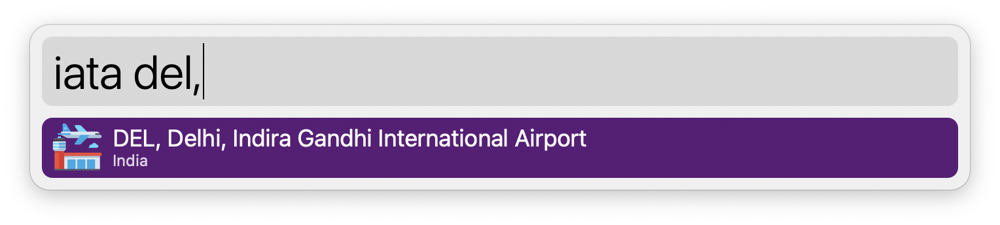

# IATA code search

Alfred workflow to search for IATA codes, cities, and airport names.

## Installation

- Download the latest [release](https://github.com/premsrii/iata-code-search/releases/download/v0.0.1/iata_code_search.alfredworkflow).
- Double-click on the downloaded `iata_code_search.alfredworkflow` file.

## Usage

To use this workflow, simply open the Alfred command bar and type the keyword `iata` followed by a space and the query.

Search by IATA codes:

or by the name of the city:

or by the name of the airport:

### Tip 💡

To filter out unwanted suggestions while searching exclusively for an IATA code, add a comma at the end of the query, like so:

## Attribution

<a href="https://www.flaticon.com/free-icons/airport" title="airport icons">Airport icons created by Flat Icons - Flaticon</a>
